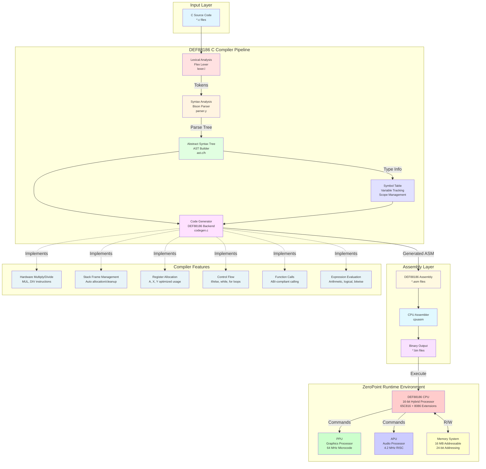
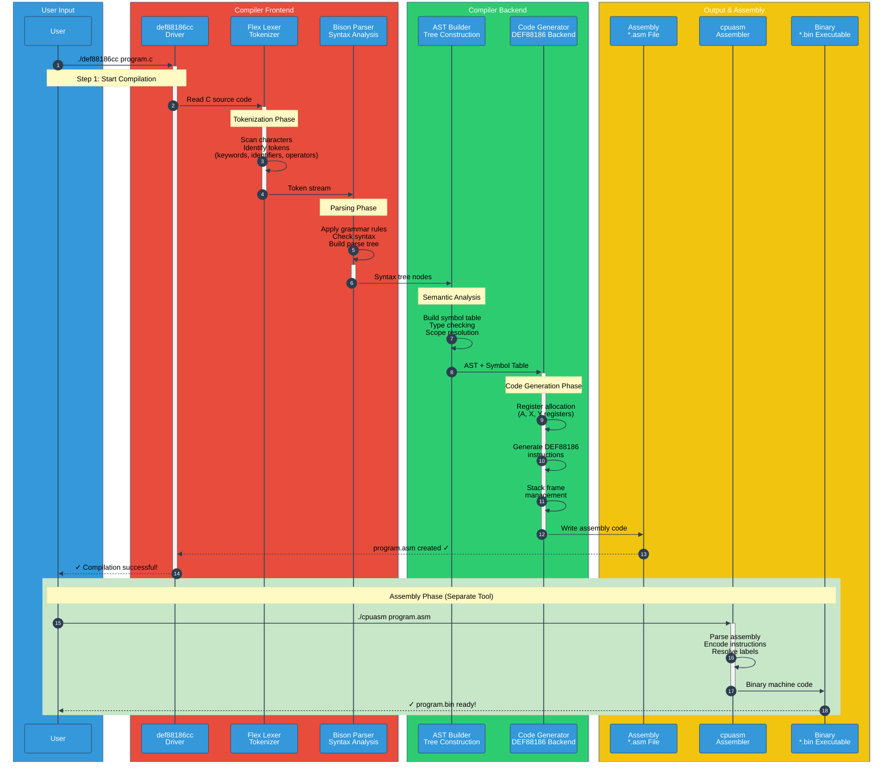

# DEF88186 C Compiler


A complete C-to-assembly compiler targeting the DEF88186 hybrid CPU architecture for the ZeroPoint Fantasy Console. This compiler bridges high-level C programming with the low-level 65C816/8086-inspired instruction set, enabling efficient game development and system programming.

## Overview

The DEF88186 C Compiler is a full-featured compiler toolchain that translates a practical subset of C into native DEF88186 assembly language. Built with industry-standard tools (Flex & Bison), it provides a robust compilation pipeline with lexical analysis, syntax parsing, Abstract Syntax Tree (AST) construction, and optimized code generation targeting the 16-bit DEF88186 CPU.

### Key Highlights

- **Full Compiler Pipeline**: Lexer → Parser → AST → Code Generator → Assembly Output
- **Hardware-Aware**: Leverages DEF88186's hardware multiply/divide instructions for performance
- **ABI Compliant**: Follows standard DEF88186 calling conventions for interoperability
- **Stack Management**: Automatic stack frame allocation and cleanup
- **Register Optimization**: Efficient use of A, X, Y registers and direct page addressing

## System Architecture



## Compilation Flow



## Features

- **Complete C Compiler**: Compiles practical C subset to DEF88186 assembly
- **Data Types**: `int` (16-bit), `char` (8-bit), `void`, `struct`, arrays, pointers
- **Functions**: Parameters, return values, recursion, calling conventions
- **Variables**: Local, global, function parameters with proper scoping
- **Control Flow**: `if/else`, `while`, `for`, `break`, `continue`, `return`
- **Operators**: Arithmetic, logical, bitwise, comparison, compound assignments, increment/decrement
- **Pointers**: Address-of (`&`), dereference (`*`), multi-level pointers
- **Structs**: Member access (`.`), pointer access (`->`), member assignment
- **Arrays**: Fixed-size arrays with subscript access and assignment
- **Hardware Optimization**: Automatic `LOOP`/`LPEND` for counted loops, hardware `MUL`/`DIV`
- **ABI Compliant**: Follows DEF88186 calling conventions for interoperability

## Supported C Subset

### Data Types
- `int` - 16-bit signed integer
- `char` - 8-bit signed character
- `void` - no return value
- `struct` - Structured data types with member access
- Arrays - Fixed-size arrays (e.g., `int arr[10]`)
- Pointers - Single and multi-level pointers with dereference

### Operators
- Arithmetic: `+`, `-`, `*`, `/`, `%`
- Comparison: `==`, `!=`, `<`, `>`, `<=`, `>=`
- Logical: `&&`, `||`, `!`
- Bitwise: `&`, `|`, `^`, `~`, `<<`, `>>`
- Assignment: `=`
- Compound Assignment: `+=`, `-=`, `*=`, `/=`, `%=`, `&=`, `|=`, `^=`
- Increment/Decrement: `++`, `--` (prefix and postfix)
- Pointer: `&` (address-of), `*` (dereference)
- Member Access: `.` (struct), `->` (pointer to struct)

### Control Flow
- `if (expr) stmt`
- `if (expr) stmt else stmt`
- `while (expr) stmt`
- `for (init; cond; incr) stmt`
- `break` - Exit loop early
- `continue` - Skip to next iteration
- `return expr;`

### Functions
```c
int add(int a, int b) {
    return a + b;
}
```

### Variables
- Local variables
- Function parameters
- Global variables (basic support)
- **Arrays**: Fixed-size local arrays with subscript access

### Arrays
```c
int main() {
    int arr[10];      // Declare array
    arr[0] = 42;      // Write to array
    arr[5] = arr[0];  // Read from array
    return arr[5];
}
```

**Array Features:**
- Declaration: `type identifier[size];`
- Subscript access: `arr[index]`
- Assignment: `arr[index] = value;`
- Stack-allocated (local arrays only)
- Supports variable indexing

### Pointers
```c
int main() {
    int x = 42;
    int *ptr = &x;    // Get address of x
    int y = *ptr;     // Dereference pointer
    *ptr = 100;       // Modify through pointer
    return y;
}
```

**Pointer Features:**
- Address-of operator: `&variable`
- Dereference operator: `*pointer`
- Multi-level pointers: `int **ptr`
- Pointer arithmetic: Basic support
- Pointer parameters and return values

### Structs
```c
struct Point {
    int x;
    int y;
};

int main() {
    struct Point p;
    p.x = 10;         // Member assignment
    p.y = 20;

    struct Point *ptr = &p;
    ptr->x = 30;      // Pointer member access

    return p.x + p.y;
}
```

**Struct Features:**
- Member access: `struct.member`
- Pointer member access: `ptr->member`
- Member assignment: `p.x = value`
- Nested member access supported
- Stack-allocated structs

## Building

```bash
cd c_compiler
make
```

**Requirements:**
- GCC or Clang C compiler
- Flex (lexical analyzer generator)
- Bison (parser generator)
- Make build system

## Usage

```bash
# Compile C source to assembly
./def88186cc input.c -o output.asm

# Auto-generate output filename (input.asm)
./def88186cc input.c

# Assemble to binary
./cpuasm output.asm output.bin
```

## Examples

See `examples/` directory for sample programs:

**test1.c** - Function calls and recursion:
```c
int factorial(int n) {
    if (n <= 1) {
        return 1;
    }
    return n * factorial(n - 1);
}
```

**test2.c** - Control flow and loops:
```c
int sum_to_n(int n) {
    int sum = 0;
    int i = 1;
    while (i <= n) {
        sum = sum + i;
        i = i + 1;
    }
    return sum;
}
```

## Architecture Notes

The compiler follows DEF88186 calling conventions:
- First 3 parameters: A, X, Y registers
- Additional parameters: stack (right-to-left)
- Return value: A register
- 16-bit mode by default (REP #$30)
- Caller-saved: A, X, Y
- Callee-saved: D, DB

### Code Generation Strategy

1. **Stack Frame Setup**: Automatically allocates space for local variables
2. **Register Allocation**:
   - A: Primary accumulator, return values, expression evaluation
   - X: Second parameter, temporary storage, array indexing
   - Y: Third parameter, secondary indexing
3. **Hardware Instructions**:
   - Uses DEF88186 `MUL` and `DIV` for efficient arithmetic
   - **LOOP/LPEND optimization**: Automatically detects simple counted loops and uses hardware loop instructions
4. **Label Management**: Generates unique labels for control flow structures

### Hardware Loop Optimization

The compiler intelligently detects simple counted loops and uses the DEF88186's hardware `LOOP`/`LPEND` instructions:

**Pattern Detected:**
```c
for (i = 0; i < N; i = i + 1)  // N must be constant
```

**Generated Code:**
```asm
LOOP #N          ; Hardware loop counter
    ; loop body
    i = i + 1    ; increment
LPEND            ; Auto-decrement and branch
```

**Benefits:**
- Faster execution (hardware-managed counter)
- Smaller code size (no manual labels/branches)
- More efficient than manual `CMP`/`BRA` loops

**Falls back to manual loops when:**
- Loop bound is not a constant
- Complex condition (e.g., `i < j` where both are variables)
- Non-unit increment (e.g., `i = i + 2`)

## Compiler Internals

| Component | File | Description |
|-----------|------|-------------|
| Lexer | `lexer.l` | Tokenizes C source code (Flex) |
| Parser | `parser.y` | Builds parse tree (Bison) |
| AST | `ast.h/c` | Abstract Syntax Tree implementation |
| Symbol Table | `codegen.c` | Variable and scope tracking |
| Code Generator | `codegen.c` | DEF88186 assembly emission |
| Driver | `main.c` | Compiler entry point |

## Limitations

- No floating point arithmetic
- No type qualifiers (const, volatile, static)
- No preprocessor (use cpp separately)
- No inline assembly
- No multi-dimensional arrays
- No array initialization lists
- No unions
- No function pointers
- No variadic functions (printf-style)
- Pointer arithmetic is basic (no complex expressions)

## Performance Considerations

- **Hardware Multiply/Divide**: 8-13 cycles vs 100+ cycles for software implementation
- **Hardware Loops**: `LOOP`/`LPEND` instructions optimize simple counted loops
- **Register Parameters**: First 3 parameters avoid stack overhead
- **Direct Page Access**: Local variables use fast DP addressing when possible
- **Compound Assignments**: Efficiently compiled using read-modify-write patterns
- **Tail Call Optimization**: Not yet implemented

## Future Enhancements

- [x] Array support ✓ **DONE!**
- [x] Pointer support with pointer arithmetic ✓ **DONE!**
- [x] Struct support with member access ✓ **DONE!**
- [x] Increment/decrement operators (++/--) ✓ **DONE!**
- [x] Compound assignment operators (+=, -=, etc.) ✓ **DONE!**
- [x] Break and continue statements ✓ **DONE!**
- [ ] Multi-dimensional arrays
- [ ] Array initialization lists
- [ ] Union support
- [ ] Function pointers
- [ ] Switch/case statements
- [ ] Ternary operator (?:)
- [ ] Comma operator
- [ ] sizeof operator
- [ ] Preprocessor integration
- [ ] Optimization passes (constant folding, dead code elimination)
- [ ] Inline assembly support
- [ ] Better error messages with line/column numbers
- [ ] Optimization flags (-O1, -O2, -O3)

## Contributing

Part of the ZeroPoint Fantasy Console project. Built with Claude Code.

## License

See main project LICENSE file.

---

**Built with [Claude Code](https://claude.com/claude-code)**

Co-Authored-By: Claude <noreply@anthropic.com>
