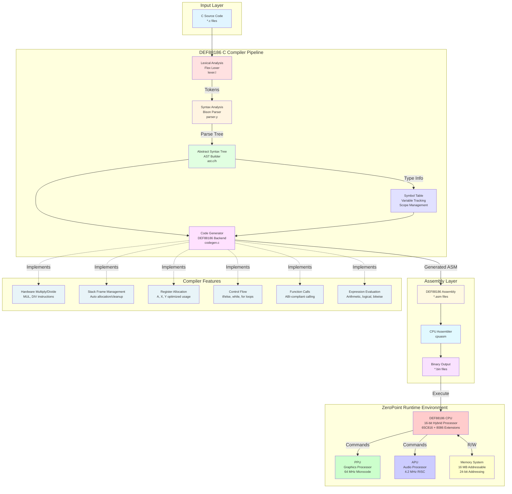
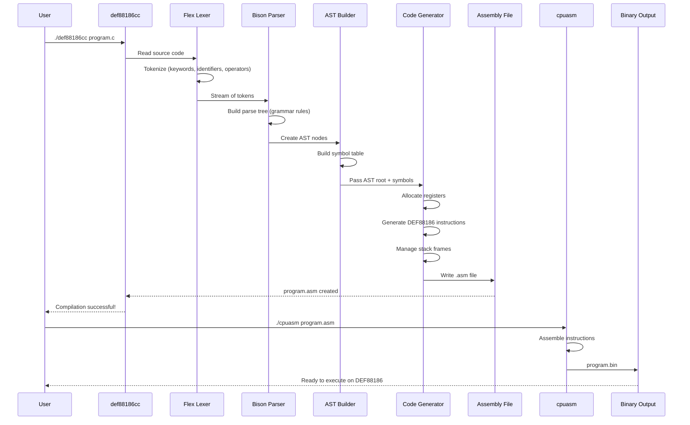

# DEF88186 C Compiler


A complete C-to-assembly compiler targeting the DEF88186 hybrid CPU architecture for the ZeroPoint Fantasy Console. This compiler bridges high-level C programming with the low-level 65C816/8086-inspired instruction set, enabling efficient game development and system programming.

## Overview

The DEF88186 C Compiler is a full-featured compiler toolchain that translates a practical subset of C into native DEF88186 assembly language. Built with industry-standard tools (Flex & Bison), it provides a robust compilation pipeline with lexical analysis, syntax parsing, Abstract Syntax Tree (AST) construction, and optimized code generation targeting the 16-bit DEF88186 CPU.

### Key Highlights

- **Full Compiler Pipeline**: Lexer → Parser → AST → Code Generator → Assembly Output
- **Hardware-Aware**: Leverages DEF88186's hardware multiply/divide instructions for performance
- **ABI Compliant**: Follows standard DEF88186 calling conventions for interoperability
- **Stack Management**: Automatic stack frame allocation and cleanup
- **Register Optimization**: Efficient use of A, X, Y registers and direct page addressing

## System Architecture



## Compilation Flow



## Features

- Compiles a subset of C to DEF88186 assembly
- Supports basic data types: `int` (16-bit), `char` (8-bit), `void`
- Functions with parameters and return values
- Local variables and function arguments
- Control flow: `if/else`, `while`, `for`
- Arithmetic and logical operations
- Following DEF88186 calling conventions

## Supported C Subset

### Data Types
- `int` - 16-bit signed integer
- `char` - 8-bit signed character
- `void` - no return value
- Pointers (basic support)

### Operators
- Arithmetic: `+`, `-`, `*`, `/`, `%`
- Comparison: `==`, `!=`, `<`, `>`, `<=`, `>=`
- Logical: `&&`, `||`, `!`
- Bitwise: `&`, `|`, `^`, `~`, `<<`, `>>`
- Assignment: `=`

### Control Flow
- `if (expr) stmt`
- `if (expr) stmt else stmt`
- `while (expr) stmt`
- `for (init; cond; incr) stmt`
- `return expr;`

### Functions
```c
int add(int a, int b) {
    return a + b;
}
```

### Variables
- Local variables
- Function parameters
- Global variables (basic support)

## Building

```bash
cd c_compiler
make
```

**Requirements:**
- GCC or Clang C compiler
- Flex (lexical analyzer generator)
- Bison (parser generator)
- Make build system

## Usage

```bash
# Compile C source to assembly
./def88186cc input.c -o output.asm

# Auto-generate output filename (input.asm)
./def88186cc input.c

# Assemble to binary
./cpuasm output.asm output.bin
```

## Examples

See `examples/` directory for sample programs:

**test1.c** - Function calls and recursion:
```c
int factorial(int n) {
    if (n <= 1) {
        return 1;
    }
    return n * factorial(n - 1);
}
```

**test2.c** - Control flow and loops:
```c
int sum_to_n(int n) {
    int sum = 0;
    int i = 1;
    while (i <= n) {
        sum = sum + i;
        i = i + 1;
    }
    return sum;
}
```

## Architecture Notes

The compiler follows DEF88186 calling conventions:
- First 3 parameters: A, X, Y registers
- Additional parameters: stack (right-to-left)
- Return value: A register
- 16-bit mode by default (REP #$30)
- Caller-saved: A, X, Y
- Callee-saved: D, DB

### Code Generation Strategy

1. **Stack Frame Setup**: Automatically allocates space for local variables
2. **Register Allocation**:
   - A: Primary accumulator, return values, expression evaluation
   - X: Second parameter, temporary storage, array indexing
   - Y: Third parameter, secondary indexing
3. **Hardware Instructions**: Uses DEF88186 `MUL` and `DIV` for efficient arithmetic
4. **Label Management**: Generates unique labels for control flow structures

## Compiler Internals

| Component | File | Description |
|-----------|------|-------------|
| Lexer | `lexer.l` | Tokenizes C source code (Flex) |
| Parser | `parser.y` | Builds parse tree (Bison) |
| AST | `ast.h/c` | Abstract Syntax Tree implementation |
| Symbol Table | `codegen.c` | Variable and scope tracking |
| Code Generator | `codegen.c` | DEF88186 assembly emission |
| Driver | `main.c` | Compiler entry point |

## Limitations

- No structs/unions
- No floating point
- Limited pointer arithmetic
- No type qualifiers (const, volatile)
- No preprocessor (use cpp separately)
- No arrays (coming soon)
- No inline assembly

## Performance Considerations

- **Hardware Multiply/Divide**: 8-13 cycles vs 100+ cycles for software implementation
- **Register Parameters**: First 3 parameters avoid stack overhead
- **Direct Page Access**: Local variables use fast DP addressing when possible
- **Tail Call Optimization**: Not yet implemented

## Future Enhancements

- [ ] Array support with pointer arithmetic
- [ ] Struct and union support
- [ ] Preprocessor integration
- [ ] Optimization passes (constant folding, dead code elimination)
- [ ] Inline assembly support
- [ ] Better error messages with line/column numbers
- [ ] Optimization flags (-O1, -O2, -O3)

## Contributing

Part of the ZeroPoint Fantasy Console project. Built with Claude Code.

## License

See main project LICENSE file.

---

**Built with [Claude Code](https://claude.com/claude-code)**

Co-Authored-By: Claude <noreply@anthropic.com>
